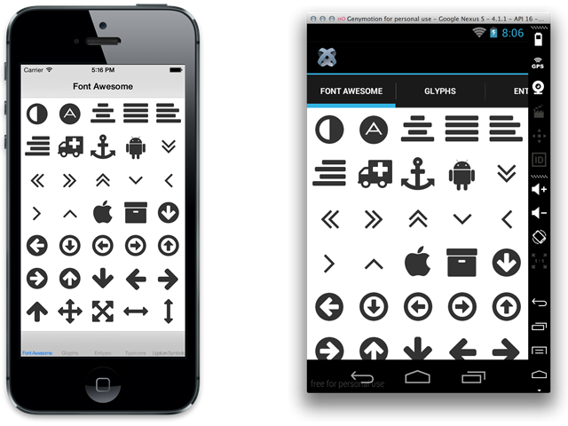
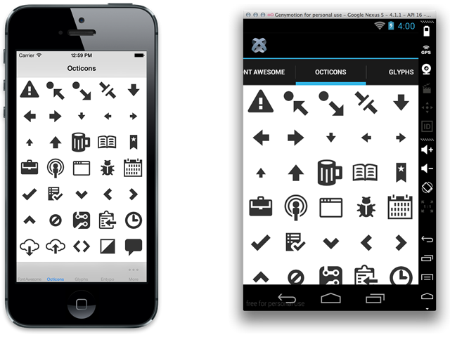
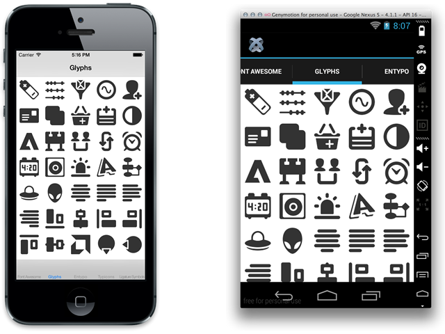
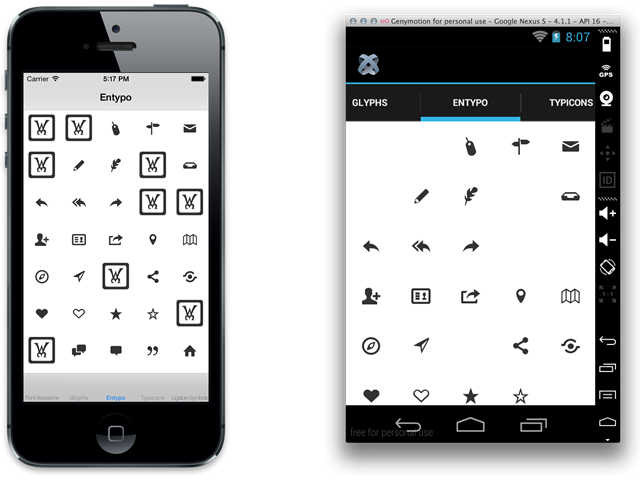
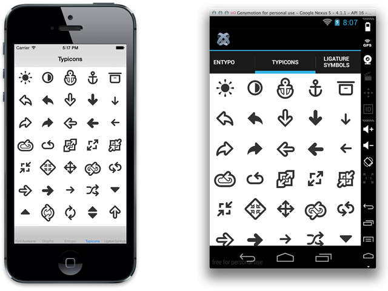
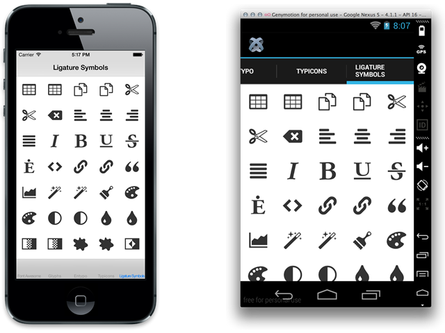
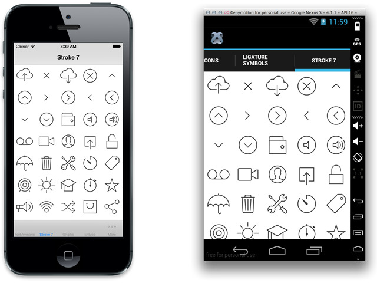
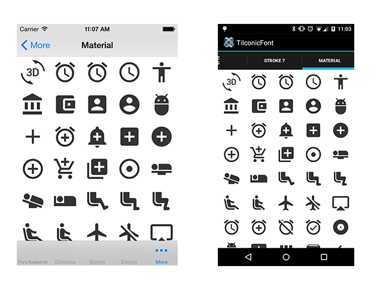

# TiIconicFont

Iconic font charcode wrapping library for Titanium.

## Install

1. Put the IconicFont.js and icon font JavaScript file on your project
2. Download and put .ttf file on Resources/fonts folder

## Usage

You can see example at [Resources/app.js](blob/master/Resources/app.js).
If you want to use in Alloy [Ti.UX.Templates](https://github.com/jaraen/Ti.UX.Templates). This project is very usefull.

```javascript
var IconicFont = require('/lib/IconicFont'),
	iconicFont = new IconicFont({
		font: '/lib/FontAwesome'
	});
var label = Ti.UI.createLabel({
	font: {
		fontFamily: iconicFont.fontfamily
	},
	text: iconicFont.icon('icon name here')
});
```

### Font Awesome



### Octicons



### Glyphs



### Entypo



### Typicons



### Ligature Symbols



### Stroke7



### Material



## Credits

### Font Awesome

[Font Awesome 4.1.0 Created by Dave Gandy](http://fontawesome.io/), [SIL Open Font Licence](http://scripts.sil.org/OFL)

### Octicons

[Octicons 2.0.1 Created by GitHub](http://octicons.github.com/), [SIL Open Font Licence](http://scripts.sil.org/OFL)

### Glyphs

[WebHostingHub Glyphs Created by WebHostingHub](http://www.webhostinghub.com/glyphs/), [SIL Open Font Licence](http://scripts.sil.org/OFL)

### Entypo

[Entypo pictograms 2.0 by Daniel Bruce](www.entypo.com), [SIL Open Font Licence](http://scripts.sil.org/OFL)

### Typicons

[Typicons 2.0.3 Created by Stephen Hutchings](http://typicons.com/), [SIL Open Font Licence](http://scripts.sil.org/OFL)

### Ligature Symbols

[Ligature Symbols 2.11 Created by Kazuyuki Motoyama](http://kudakurage.com/ligature_symbols/), [SIL Open Font Licence](http://scripts.sil.org/OFL)

### Stroke 7

[Stroke 7 1.1.0 by Pixeden](http://themes-pixeden.com/font-demos/7-stroke/index.html), [Pixeden Resource Licence](http://www.pixeden.com/license)

## License

The MIT License (MIT) Copyright (c) 2014 Kosuke Isobe